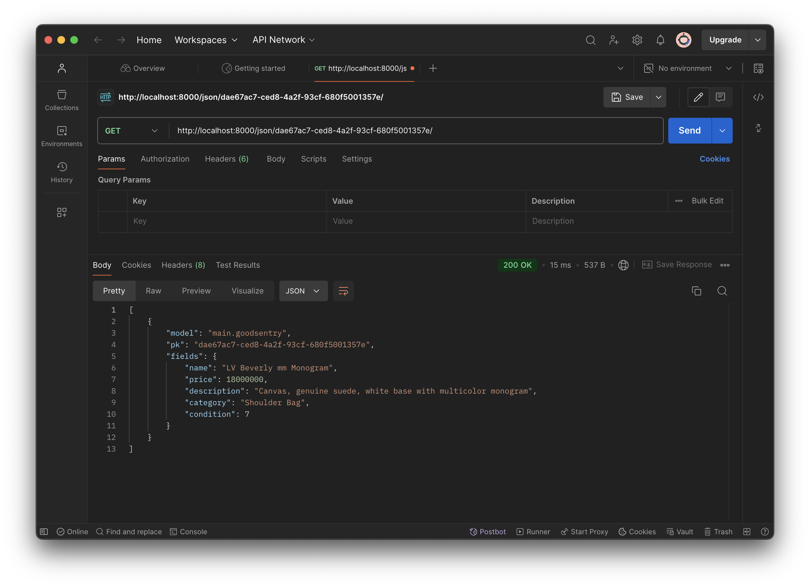

# Trésor Révélé
link PWS: http://meutia-fajriyah-tresorrevele.pbp.cs.ui.ac.id

<details>
<Summary><b>Tugas 2</b></Summary>

### 1. Jelaskan bagaimana cara kamu mengimplementasikan checklist di atas secara step-by-step (bukan hanya sekadar mengikuti tutorial).
1. Instalasi python, django, github, dan virtual environment.
2. Buat directory baru dengan nama "tresor-revele" lalu menambahkan requirements, dependencies, dan konfigurasi yang diperlukan untuk melakukan deployment nanti.
3. Membuat project dan aplikasi (main) menggunakan startproject dan startapp dan menambahkan main ke INSTALLED_APPS.
4. Menambahkan atribut dan property yang diperlukan pada models.py lalu migrasi model untuk update data base menggunakan makemigrations dan migrate.
5. Menambahkan data yang diperlukan pada views.py.
6. Membuat main.html sebagai template tampilan yang akan diberikan.
7. Menghubungkan urls aplikasi dan project.
8. Membuat repository baru lalu add, commit, dan push folder "tresor-revele".
9. Setelah berhasil menghubungkan ke github, deploy project ke Pacil Web Service (PWS) agar dapat diakses dari device lain.
10. Selesai! Website dapat dibuka melalui [link ini](http://meutia-fajriyah-tresorrevele.pbp.cs.ui.ac.id).

### 2. Buatlah bagan yang berisi request client ke web aplikasi berbasis Django beserta responnya dan jelaskan pada bagan tersebut kaitan antara urls.py, views.py, models.py, dan berkas html.

* urls.py: untuk memetakan URL yang sesuai dan menghubungkan dengan views (views.py).
* views.py: logic dari sebuah aplikasi, digunakan untuk mengembalikan data yang sesuai dengan request.
* models.py: berisi atribut dari tabel di database, untuk mendefinisikan model data aplikasi.
* template html: file yang digunakan untuk menyusun tampilan akhir sebuah aplikasi dan menampilkan data yang dibutuhkan.

### 3. Jelaskan fungsi git dalam pengembangan perangkat lunak!
Git memudahkan pengembang dalam **berkolaborasi**, menyimpan **back-up data**, melakukan **branching**, dan **melihat atau menggunakan ulang versi lama dari kode** tertentu. Dengan menggunakan git, perangkat lunak yang dalam pengembangannya melibatkan banyak orang dapat dengan mudah disesuaikan karena sebuah repository dapat diakses dan dipakai oleh semua pihak bersangkutan. Bagi pengguna pribadi, git juga dapat digunakan sebagai tempat penyimpanan back-up data yang kita perlukan dalam proses pengembangan software. Hal ini akan mengurangi risiko kehilangan data penting yang dapat menghambat proses developing.

### 4. Menurut Anda, dari semua framework yang ada, mengapa framework Django dijadikan permulaan pembelajaran pengembangan perangkat lunak?
Django dipilih sebagai framework untuk pemula karena:
* Django sudah memiliki banyak fitur bawaan yang dapat mempermudah kita untuk membuat dan mengembangkan sebuah software.
* Django dinilai sebagai salah satu framework yang memiliki dokumentasi paling lengkap, sehingga mudah untuk dipelajari lebih lanjut.
* Django memiliki prinsip DRY atau Don't Repeat Yourself, prinsip ini membuat code pada Django lebih efisien dan tidak repetitif.
* Django memiliki struktur yang jelas dan tidak membingungkan bagi pemula. Pada Django, aplikasi yang berbeda akan otomatis berada pada folder yang berbeda juga.
* Django dapat digunakan untuk membuat project kecil maupun besar.

### 5. Mengapa model pada Django disebut sebagai ORM?
Karena, Django menggunakan teknik ORM atau Object-Relational-Mapping yang mememungkinkan pengembang mengakses database relasional seperti PostgreSQL, MySQL, dan SQLite dengan menggunakan kode python, tanpa perlu menulis query SQL (akses, kelola, manipulasi data) secara manual.
</details>

<details>
<Summary><b>Tugas 3</b></Summary>

### 1. Jelaskan mengapa kita memerlukan data delivery dalam pengimplementasian sebuah platform?
Data delivery berguna dalam berjalannya suatu platform. Pada fungsi tertentu, kita akan butuh mengirim dan menerima data dari suatu stack. Biasanya, data delivery dalam pengembangan platform diperlukan untuk mentransfer dari dari server ke client, atau antaraplikasi. Dalam pengimplementasian platform, data delivery memiliki tujuan untuk menyampaikan dan menerima informasi dan memberikan update secara real time.

### 2. Menurutmu, mana yang lebih baik antara XML dan JSON? Mengapa JSON lebih populer dibandingkan XML?
Setelah membaca dari w3schools, menurut saya, **JSON lebih baik dibanding XML**. Dalam pengekstrakannya, format XML jauh lebih susah dilakukan daripada yang menggunakan format JSON. JSON dalam pemrosesannya akan diurai menjadi object JavaScript yang sudah siap untuk diolah, sedangkan XML memerlukan cara yang kompleks dan harus melakukan import libraries khusus. Kelebihan yang dimiliki oleh JSON adalah alasan mengapa JSON lebih populer dibandingkan dengan XML.
Referensi: https://www.w3schools.com/js/js_json_xml.asp

### 3. Jelaskan fungsi dari method is_valid() pada form Django dan mengapa kita membutuhkan method tersebut?
Method is_valid() pada Django berfungsi untuk memeriksa data yang disubmit apakah sudah valid dan sesuai dengan aturan yang berlaku. Method ini akan melakukan pengecekan terhadap tipe data, format input, dan batas panjang. Method ini juga membantu kita dalam mendapatkan data yang seragam pada database, saat ada data yang tidak sesuai, method akan mengembalikan error dan meminta koreksi dari pengguna sehingga data yang tidak sesuai tidak akan ditambahkan ke database. Sebagai pengembang, kita memerlukan method is_valid() ini untuk membantu kita dalam melakukan validasi terhadap data yang masuk.

### 4. Mengapa kita membutuhkan csrf_token saat membuat form di Django? Apa yang dapat terjadi jika kita tidak menambahkan csrf_token pada form Django? Bagaimana hal tersebut dapat dimanfaatkan oleh penyerang?
csrf_token adalah token yang berfungsi sebagai pengaman software. Token ini merupakan bawaan dari Django yang memang dibuat untuk mencegah serangan-serangan yang dapat terjadi. Jika kita tidak menambahkan csrf_token pada form Django, form akan menjadi rentan terhadap serangan Cross-Site Request Forgery (CSRF) di mana penyerang akan membuat korban secara tidak sadar melakukan perintah yang dapat mentransfer data ke tangan pihak yang tidak berwenang.

### 5. Jelaskan bagaimana cara kamu mengimplementasikan checklist di atas secara step-by-step (bukan hanya sekadar mengikuti tutorial).
1. Pada tugas ini, saya menambahkan base.html untuk memastikan setiap page memiliki layout yang mirip. Jadi, saat menambah page di subdirectory main, hanya perlu merubah code di dalam block tertentu.
2. Untuk membuat input form, pertama, buat file baru dengan nama forms.py. isi file ini dengan model yang sudah ada pada models.py. Lalu, pada views.py, saya menambahkan beberapa import tambahan dan membuat function baru create_goods_entry. Function ini digunakan untuk membuat form yang nantinya akan menambahkan list product ke data base. Kemudian, pada file urls.py, tambahkan url path dari function-function tersebut ke urlpatterns. Terakhir, saya membuat template html baru yang akan digunakan untuk memanggil function form yang sudah dibuat.
3. Untuk melihat object yang ditambah pada form dalam formal XML, JSON, XML by ID, dan JSON by ID, saya menambahkan 4 function pada program. 4 function itu adalah: show_xml, show_json, show_xml_by_id, show_json_by_id. Function-function yang telah dibuat ini perlu diimport dan ditambahkan ke urlpatterns pada urls.py agar dapat dijalankan.
4. Selesai! checklist tugas kali ini sudah terpenuhi.

### Postman Screenshot
* **URL XML**

* **URL XML by ID**

* **URL JSON**

* **URL JSON by ID**

</details>

<details>
<Summary><b>Tugas 4</b></Summary>

### 1. Apa perbedaan antara HttpResponseRedirect() dan redirect()
* HttpResponseRedirect() : Function untuk mengarahkan user ke URL yang diberikan, menerima URL dalam bentuk string.
```py
    ...
    response = HttpResponseRedirect(reverse("main:show_main"))
    ...
```
* redirect() : Shortcut bawaan Django untuk membuat sebuah object, dapat menerima URL dalam bentuk string, object model, atau URL dari routing.
```py
    ...
    return redirect('main:show_main')
    ...
```

### 2. Jelaskan cara kerja penghubungan model Product dengan User!
Penghubungan model Product dengan User adalah dengan menggunakan sebuah relationship yaitu ForeignKey, di mana sebuah model pasti akan terhubung dengan seorang user. ForeignKey sendiri adalah relationship di Django yang digunakan untuk mendefinisikan hubungan many-to-one (banyak ke satu) antara dua model. 

### 3. Apa perbedaan antara authentication dan authorization, apakah yang dilakukan saat pengguna login? Jelaskan bagaimana Django mengimplementasikan kedua konsep tersebut.
* Authentication: proses memastikan atau membuktikan **siapa** yang ingin melakukan aktifitas login
* Authorization: proses lanjutan setelah authentication berhasil, verifikasi akses **apa** saja yang bisa dilakukan oleh seseorang
* Apa yang dilakukan saat pengguna login? Setelah dilakukan submit pada login form, program akan melakukan **authentication** dan **authorization**, jika data ditemukan pada database, program akan lanjut untuk membuat session baru.
* Django mengimplementasikan konsep authentication dengan bantuan built-in framework yang sudah tersedia (django.contrib.auth), sedangkan konsep authorization melalui models dan penggunaan decorator.

### 4. Bagaimana Django mengingat pengguna yang telah login? Jelaskan kegunaan lain dari cookies dan apakah semua cookies aman digunakan?
Django memengingat pengguna yang telah login dengan menggunakan session cookies, saat pengguna login, Django menyimpan sesi pengguna di server dan mengirimkan ID sesi tersebut dalam bentuk cookie ke browser server lalu ketika pengguna mengunjungi website lain, Django akan menggunakan cookie ini untuk mengidentifikasi dan mengingat status login pengguna sebelumnya.
Kegunaan lain dari cookie adalah penyimpanan preferensi aktivitas pengguna, hal ini bermanfaat untuk memberikan pengalaman browsing yang terpersonalisasi bagi si pengguna kelak. Apakah semua cookies aman digunakan? Jawabannya adalah **tidak**, cookie yang tidak dienkripsi dengan aman dapat menerima serangan CSRF maupun Hijacking dari pihak yang tidak bertanggung jawab. 

### 5. Jelaskan bagaimana cara kamu mengimplementasikan checklist di atas secara step-by-step (bukan hanya sekadar mengikuti tutorial).
1. Untuk membuat function registrasi, pertama saya membuat function baru pada views.py yang berguna untuk merender form register, lalu saya juga menambahkan template html yang sesuai, setelah itu saya melakukan routing pada urls dengan import dan menambahkan path pada urlpatterns.
2. Untuk membuat function login, saya membuat function baru lagi pada views.py untuk authentication user yang akan login, setelah itu saya lanjur membuat template html untuk page login, terakhir, saya melakukan routing pada urls dengan import dan menambahkan path pada urlpatterns.
3. Selanjutnya saya akan membuat function logout, stepsnya kurang lebih sama seperti saat saya membuat function login. Menambahkan function di views.py, lalu membuat button tambahan di main.html untuk melakukan logout dan mengarahkan user kembali ke halaman login. lalu melakukan routing pada urls dengan import dan menambahkan path pada urlpatterns.
4. Checklist selanjutnya dapat diimplementasikan dengan melakukan 2 kali register dan menambahkan 3 dummy data pada 2 akun yang berbeda.
5. Kemudian, untuk menghubungkan model product dengan user, saya perlu menambahkan ForeignKey pada models yang sudah dibuat sebelumnya, setelah melakukan perubahan pada models.py jangan lupa untuk melakukan makemigrations dan migrate.
6. Terakhir, untuk menampilkan informasi pengguna yang sedang login, saya mengubah function last_login pada views.py agar dapat membuat cookie dan menambahkannya ke response, kemudian pada main.html, saya menambahkan line untuk menampilkan informasi last login di bagian paling bawah halaman utama aplikasi.
7. Selesai!
</details>

<details>
<Summary><b>Tugas 5</b></Summary>

### 1. Jika terdapat beberapa CSS selector untuk suatu elemen HTML, jelaskan urutan prioritas pengambilan CSS selector tersebut!
1. Inline Styles (prioritynya paling tinggi, langsung di-state pada element html)
2. ID Selectors (menggunakan ID element, biasanya ditandakan dengan #)
3. Class, Attribute and Pseudo-Class Selectors (prioritynya di bawah ID selectors, biasanya seperti `.classname`, `[type="text"]`, `:hover`)
4. Element and Pseudo-Element Selectors (prioritynya paling rendah, seperti tags `div`, `h1`, `p`)
5. !important Rule (akan mengabaikan aturan lain)

### 2. Mengapa responsive design menjadi konsep yang penting dalam pengembangan aplikasi web? Berikan contoh aplikasi yang sudah dan belum menerapkan responsive design!
Sebagai pengembang, kita tidak dapat mengontrol dari device mana saja pengguna akan mengakses website kita, maka dari itu, penting untuk memberikan penyesuaian design agar website dapat tampil optimal di berbagai device dengan ukuran layar yang berbeda, seperti smartphone, tablet, laptop, atau desktop. Tanpa responsive design, tampilan website bisa terlihat berantakan dan tidak nyaman digunakan pada perangkat dengan ukuran layar yang berbeda.

Contoh aplikasi yang sudah menerapkan responsive design pada desktop maupun mobile views adalah Shopee, sedangkan yang belum adalah aren.cs.ui.ac.id

### 3. Jelaskan perbedaan antara margin, border, dan padding, serta cara untuk mengimplementasikan ketiga hal tersebut!
* Margin (ruang di luar border), cara implementasi:
```css
div {
    margin: 20px;
}
```
* Border (garis di sekitar elemen yang mengelilingi padding), cara implementasi:
```css
div {
    border: 2px solid black;
}
```
* Padding (ruang di dalam elemen, antara content dan border), cara implementasi:
```css
div {
    padding: 10px;
}
```

### 4. Jelaskan konsep flex box dan grid layout beserta kegunaannya!
*
**Flexbox** digunakan untuk membuat layout yang fleksibel dan responsif secara vertikal atau horizontal, **kegunaannya** adalah untuk mengatur alignment, mengatasi masalah spacing, dan memudahkan pembuatan layout
*
**Grid layout** merupakan sistem 2D yang membagi halaman web ke dalam baris dan kolom, ini memberi kontrol yang lebih kompleks dari flexbox untuk membuat layout yang lebih terstruktur, **kegunaannya** adalah untuk membuat layout yang kompleks dan menyederhanakan pembuatan grid

### 5. Jelaskan bagaimana cara kamu mengimplementasikan checklist di atas secara step-by-step (bukan hanya sekadar mengikuti tutorial)!
1. Checklist pertama pada tugas ini adalah menambahkan function edit dan delete products, saya mengimplementasikannya dengan melakukan import dan menambahkan function `edit_goods` dan `delete_goods` pada `views.py`, setelah itu saya juga membuat templates yang sesuai dan melakukan routing pada `urls.py` dengan import dan menambahkan path pada urlpatterns.
2. Checklist selanjutnya adalah kustomisasi templates html yang sudah dibuat dari tugas-tugas sebelumnya, untuk project ini saya memilih untuk menggunakan framework **Tailwind**.
* Untuk menambahkan tailwind ke project ini, saya memodifikasi file `base.html` untuk dapat menyambungkan template django ke tailwind serta menyesuaikan adanya perubahan device (mobile).
* Selanjutnya, tiap templates `login.html`, `register.html`, `main.html`, `create_goods_entry.html`, `edit_goods.html` saya modifikasi sesuai dengan tema aplikasi yang saya inginkan, tiap product yang ada dalam products list nantinya juga akan ditampilkan pada `card_goods.html` beserta models yang dimilikinya.
* Kemudian, pada setiap card products, saya menambahkan button untuk mengedit dan menghapus entries pada bagian bawah card untuk memudahkan user dalam melakukan penyesuaian.
* Terakhir, untuk menambahkan navigation bar pada website, kita perlu membuat templates baru dengan nama `navbar.html`, design pada navigation bar dibagi menjadi dua bagian, yaitu untuk desktop dan mobile (dengan burger button), lalu include navbar pada semua page templates yang diinginkan.
3. Selesai! checklist Tugas 5 sudah terimplementasi dengan lengkap.
</details>

<details>
<Summary><b>Tugas 6</b></Summary>

### 1. Jelaskan manfaat dari penggunaan JavaScript dalam pengembangan aplikasi web!
* DOM (Document Object Model), pengembang dapat mengubah, mengambil, dan menghapus elements pada HTML dan CSS secara langsung, memungkinkan perubahan tampilan halaman secara real-time
* Javascript didukung oleh semua browser modern, sehingga kode yang sudah ada dapat berjalan di berbagai platform tanpa perlu penyesuaian tambahan
* Asynchronous features melalui AJAX (Asynchronous JavaScript And XML), memungkinkan web untuk memperbarui data pada halaman tanpa harus reload keseluruhan
* Interaktif, JavaScript memungkinkan pengembang untuk membuat elemen interaktif seperti menu dropdown, slider gambar, dan form dinamis yang meningkatkan pengalaman pengguna
* Memiliki banyak library dan framework yang dapat diakses oleh pengembang untuk meningkatkan efisiensi pembuatan aplikasi web

### 2. Jelaskan fungsi dari penggunaan await ketika kita menggunakan fetch()! Apa yang akan terjadi jika kita tidak menggunakan await?
`await` adalah function yang digunakan untuk menunggu hasil dari function `async`. Dalam penggunaan `fetch()`, `await` memastikan memastikan bahwa kode berikutnya tidak dijalankan sebelum permintaan HTTP selesai dan data berhasil diterima. Function `await` juga memungkinkan pengimplementasian AJAX tanpa perlu menggunakan library eksternal.

Jika tidak menggunakan `await`, kode akan terus berjalan tanpa menunggu respon dari fetch(), sehingga data yang dibutuhkan mungkin belum tersedia saat digunakan. Ini dapat menyebabkan error atau hasil yang tidak diinginkan karena operasi asynchronous belum selesai.

### 3. Mengapa kita perlu menggunakan decorator csrf_exempt pada view yang akan digunakan untuk AJAX POST?
Decorator `csrf_exempt` dipakai untuk membuat Django tidak perlu mengecek keberadaan `csrf_token` pada POST request yang dikirimkan ke function ini. Penggunaannya pada view AJAX POST diperlukan agar permintaan tidak diblokir oleh perlindungan CSRF Django, ini memungkinkan pengiriman data melalui AJAX tanpa harus menyertakan token CSRF setiap kali. Namun, penggunaan `csrf_exempt` harus dilakukan dengan hati-hati untuk menjaga keamanan website dari serangan CSRF.

### 4. Pada tutorial PBP minggu ini, pembersihan data input pengguna dilakukan di belakang (backend) juga. Mengapa hal tersebut tidak dilakukan di frontend saja?
* Frontend lebih rentan untuk dimanipulasi oleh pihak luar, sehingga pembersihan di frontend saja tidak cukup untuk melindungi aplikasi dari serangan berbahaya seperti SQL Injection atau Cross-Site Scripting (XSS)
* Web app menerima data dari berbagai sumber (seperti API/third-party-tools), dengan melakukan pembersihan di backend juga, kita dapat memastikan bahwa semua data telah divalidasi dan disanitasi dengan benar sebelum diproses lebih lanjut oleh aplikasi
* Memudahkan pemeliharaan dan pembaruan kode, karena aturan pembersihan dapat diubah di backend tanpa perlu memperbarui semua klien frontend
* Perlindungan terhadap berbagai jenis serangan, seperti CSRF dan lainnya, yang membutuhkan validasi di sisi server untuk keamanan yang lebih menyeluruh.

### 5. Jelaskan bagaimana cara kamu mengimplementasikan checklist di atas secara step-by-step (bukan hanya sekadar mengikuti tutorial)!
1. Untuk checklist pertama yaitu implementasi AJAX GET
* Pertama saya merubah pemanggilan templates `card_goods.html` menjadi permintaan AJAX GET, perubahan tersebut dilakukan dengan menambahkan function `getGoodsEntries` dan `refreshGoodsEntries` pada block `<script>` di `main.html`
* Untuk memastikan bahwa data yang diambil hanyalah data milik pengguna yang logged-in, saya juga menambahkan `filter(user=request.user)` pada data function `show_json` dan `show_xml` di `views.py`

2. Checklist selanjutnya adalah implementasi AJAX POST
* Pada `main.html` saya menambah button baru dengan nama `Add New Goods Entry by AJAX` yang nantinya akan menampilkan modals yang functionnya sudah dibuat pada block `<script>` di `main.html`
* Selanjutnya untuk menambahkan product baru, saya menambahkan function `add_goods_entry_ajax` pada `views.py`, function ini menggunakan decorator @csrf_exempt dan @require_POST untuk memastikan keberhasilan jalannya AJAX
* Setelah membuat function baru, saya melakukan routing pada `urls.py` dengan menambahkan import dan path ke `create_goods_entry_ajax` pada urlpatterns
* Selanjutnya saya menghubungkan button yang ada pada form modal dengan function add goods yang sudah dibuat dengan cara menambahkan function `addGoodsEntry()` pada block `<script>`, sehingga function tersebut akan dijalankan saat button submit ditekan

3. Selesai! checklist tugas 6 sudah terimplementasi.

</details>